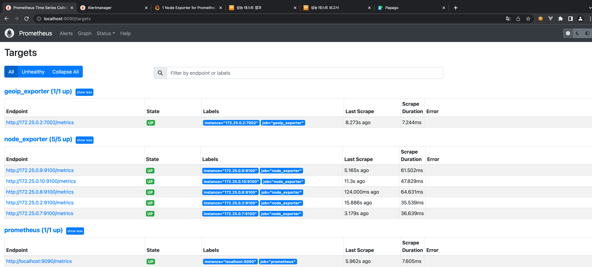
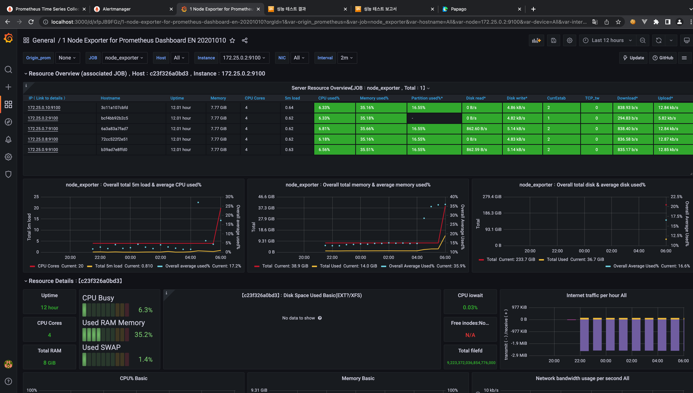
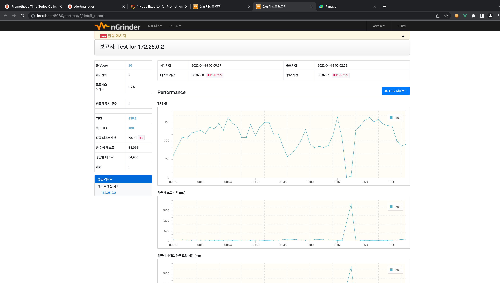

## Chapter 1. 장애 포인트를 찾기 위한 모니터링
### Local & Docker 구성
#### 1. Prometheus

#### 2. Grafana

#### 3. nGrinder

### 서비스에서의 지표
#### API CALL 수
- 현재 요청중인 초당 Call 수
- 실패한 CALL 수
#### API Latency
- 현재 API들의 속도가 Median 값, 99% 값, 최대값 등의 지표를 수집할 필요가 있음
### 서비스 노드 지표
- 서버의 상태
- CPU 사용량
- 메모리 사용량
- 디스크 사용량
- 네트워크 사용량
- 현재 동작중인 정상적인 서버의 수
### 에러의 수집
- Sentry 등의 외부 서비스 등도 많이 사용
### AWS에서 기본적인 지표들
- CloudWatch 사용
### Alarm
- 모니터링 지표가 특정 값을 넘는다면 슬랙이나 메신저 등으로 알람을 보내서 항상 특정 상황에 대한 알람이 필요
- Alarm에 등급을 나눠서 미리 전송
   - 장애의 정도: 서비스에 영향을 주는 것인지?
   - 행동의 여부: 즉각 조치가 필요한지?
### 테스트
- 성능테스트: 해당 서비스가 어느 정도의 성능을 내는지를 알아보는 테스트 (1000 TPS 등)
- 부하테스트: 어느 부분에서 어느 정보 부하가 걸리는 지를 알아보는 테스트
- 스트레스 테스트: 성능 테스트/부하테스트가 특정 시간 이상 지속적으로 안정적으로 되는지 확인하는 테스트
### 성능테스트 시에 주희할 점
- 주요 시나리오를 테스트는 하는지?
	- 단순히 API 하나만 호출하는 것이 아니라, 실제 서비스에서 사용되는 패턴으로 테스트가 필요
- 클라이언트의 성능 한계를 확인한다
	- 부하를 주는 클라이언트의 한계로 인해서 성능 측정이 어려울 수 있으므로, 클라이언트를 점점 늘리면서 테스트를 해야함
### 성능테스트 시에 확인할 부분
- OS에서 설정하는 값들에 대한 확인 필요
	- ulimit -a
		- Open Files
		- Max User Processes 라는 값의 튜닝이 필요함
	- /etc/limits.conf를 수정
### 성능테스트 툴
- Ngrinder
- Locust
- JMeter
- Gatling
- ab 

## Chapter2. 대규모 서비스 설계를 위한 백엔드 에센셜
### LoadBalancer
ri
- 사용자의 요청을 여러 서버로 분배해주는 하드웨어 or 소프트웨어 장비
### Server Side vs Client Side
- Server Side(Proxy LB)
	- Caller는 LB의 주소만 알고 LB 뒤의 상태는 알지 못함
	- 클라인트가 서버의 개별 주소를 알 필요가 없음 (로드 밸런서의 주소를 알아야 함)
	- 실제적으로 한 단계를 더 거치므로 Latency가 늘어날 수 있음 (Hop이라고 부름)
	- 로드밸런서에 장애를 발생하면 서비스가 동작하지 못함
- Client Side
	- 클라이언트가 서버의 대수 및 주소를 모두 알아야 함
	- Hop이 존재하지 않으므로 좀 더 빠른 Latency를 보여줌
	- 장애포인트가 줄어듬
	- 클라이언트에서 서버의 목록과 주소를 관리애햐 한다는 단점이 존재
### Service Discovery
- 서비스 디스커버리는 서비스나 거기에 속한 속한 서버 목록을 어떻게 찾을 것인가
- 서비스의 접속 방법을 알려주는 기능 (HTTP, TCP) 필요
- 서비스 내의 서버의 추가/제거가 있을 때 이를 알려주는 기능이 필요  
- 서비스 디스커버리 툴을 Cordinator라고 함 (Zookeeper)
#### Cordinator의 특징
- 서비스 가용성이 높음
	- 3대 이상으로 동작, 데이터 동기화 이루어짐
	- 절반 이상이 장애가 나지 않는 이상, 서비스의 유지가 가능
- 보통은 특정 값을 저장할 수 있는 대쉬보드의 역할을 함
- 노드의 순서를 보장
### Circuit Breaker
- Closed: 정상적인 API 호출이 되는 상태
- Open: 일정시간 동안 API 호출을 바로 실패하는 상태
- Half Open:
	- Open인 상태에서 일정 시간이 지나면 상태를 다시 확인하기 위해서 API 호출을 시도해보는 상태
	- Half Open 성공하면 Closed, 실패하면 다시 Open으로 이동
### Failover
- Active 한 시스테메에 장애가 발생했을 때 StandBy 서버가 Active로 전환해서 서비스가 계속 운영되게 하는 것을 말함
- 서비스 가용성 (High Availabilty) 제공하기 위해서 사용
#### VIP를 이용하는 방법
- 장애가 일어나면 VIP를 변경 
- 기존 서버의 커넥션을 끊는 작업이 필요
#### DNS를 이용하는 방법
- VIP를 이용하는 방법보다 구성이 쉬움
- 장애가 일어나면 DNS를 변경
- AWS에서 제공하는 Failover 방식
	- ELB의 Failover
	- ElastiCache의 Endpoint Failover
  - RDS의 Endpoint Failover   
- DNS를 이용한 방식에서 주의할 점
	- DNS는 TTL이 존재
		- DNS를 이용한 Failover는 DNS TTL을 짧게 설정
		- DNS 서버에 부하를 많이 줄 수 있음
### Replication
- Primary의 데이터를 Secondary에서 복사해서 데이터의 Sync를 맞추는 작업
- Replication이 안되면, 장애시 데이터의 유실이 많이 발생
### Sharding
#### Vertical Partitioning
- 하나의 Table을 컬럼 기준으로 나눔
- 자주 사용하는 컬럼과 자주 사용하지 않는 컬럼으로 나눠서 성능을 향상
#### Horizontal Partitioning
- 같은 Table을 데이터를 기준으로 나눔
- 데이터의 개수가 적어지므로 하나의 DB에서 처리해야 하는 부하가 줄어듬
- Horizontal Partitioning을 Sharding이라고 함
- 여러 대의 DB와 연결이 되어야 한다라는 단점이 있음
#### Sharding 이슈
- 데이터가 여러 대의 DB에 저장된다면, 어떤 데이터를 어디에 저장할 것인가를 알아야 함
#### Sharding Key 생성 규칙
- Range:특정 범위대역으로 나누기
	- 장점: 새로운 Shard를 추가하는 것이 다른 방식보다 쉬움
  - 단점: Shard 간의 데이터가 균등하지 못할 가능성이 높음
- Modular: 서대 대수로 나누기
	- 장점: 균등하게 분배
	- 단점: 
		- 1 대씩 서버 추가하면 데이터 이동이 심해짐
		- 1대 -> 2대 -> 4대 -> 8대 -> 16대 순으로 서버를 증가시켜야 함
- Indexed: 특정 데이터의 위치를 가리키는 서버가 존재
	- 장점: 데이터 분배를 원하는 형태로 하기 쉬움
  - 단점: Indexed 자체가 하나의 서비스가 되어야 함 
- Complexed
	- 여러 가지 형태를 섞은 형태
	- 구현이 복잡해짐
### Consistent Hashing
- 같은 Hash를 사용하면 항상 같은 결과를 보여줌
- Consistent Hashing은 장애에 안정적인가?
	- 서버의 추가/삭제 시에 리밸런싱은 적게 일어남
- Consistent Hasing은 부하에 안정적인가?
	- 서버 장애가 발생하면 해시 Ring의 다음 서버에 모든 부하를 넘김
- Consistent Hasing에서 서버의 이름을 Unique 한 Nickname을 사용해야 함 
### GUID
- 유일한 KEY (전체 유니크 key)
- 보통 8byte 정도의 크기로 사용 (64bit)
- 유일성, 시간(timestamp)으로 정렬 가능해야 함
### 비동기 큐 사용
- 무거운 작업의 처리 
- DB 작업이 아니더라도 속도가 오래 걸리는 작업을 비동기로 후처리 할 수 있음
- Worker 개수에 따라서 작업 처리량을 조절할 수 있음
- 비동기로 동작하므로 실제 DB 처리가 늦어지므로, 내가 쓴 데이터를 바로 볼 수 없을 수도 있음
	- 이를 위해 실제로 서비에서는 Cache에 먼저 저장해서 해당 결과를 서비스에서 볼 수 있도록 함 (Write-Back 형태를 취함)
### 배포
### 일반적인 무정지 배포 방법 (Rolling Update)
- LB에서 배포할 서버를 제외하고, 서버에 배포 이후 LB에 다시 추가
### Blue-Green 배포
1. 현재 Blue Set으로 서비스 중이라면, 같은 양의 Green을 준비해서 Green Set에 새로운 버전을 배포
2. Blue Set을 바라보는 설정을 Green을 바라보도록 수정
3. Blue Set을 제거
### Blue-Green 쉬운가?
- 같은 수의 장비를 쉽게 준비할 수 있을까?
	- Cloud라면 손쉬움
### On-Premis에 Blue-Green 도입
- 사용하는 리소스의 제한이 필요 (cpu, memory 절반)
- 한 서버에 두 개의 프로세스와 Proxy를 실행
- 장점: 새로운 장비의 수급없이 빠른 배포가 가능
- 단점: 리소스를 풀로 사용하지 못하므로, 부하가 많은 상황에서 배포 시 장애가 발생할 수 있음
### Canary Deployment
- 몇 대만 배포를 해서 장애를 살펴봄
- 어떻게 특정 유저들은 특정 서버로 고정할 수 있을까?
	- tag를 추가하여 redirect 

## chatper3. 대규모 트래픽 처리를 위한 Redis
### Redis 기본 자료 구조
#### Redis vs Memcached
|이름|장점|
|:---|:---|
|Redis|많은 자료 구조 제공 (k.v, list, hash, set)   Replication을 제공해서 서비스를 안정적으로 제공   Cluster 모드를 제공|
|Memcached|Redis에 비해 메모리 관리가 더 안정적|
#### Redis 사용처
- 주로 Cache를 저장하기 위한 저장소
- 특수한 케이스는 DB자체를 Redis를 사용
#### Redis 제공 자료 구조
#####  Strings
- Key / value를 사용하는 자료구조
- Key를 이용해서 Data를 저장하고 가져옴
- 기본적인 Hash Table을 이용 
- 명령어
	- get / set
	- mget / mset
##### list
- 중간에 추가/삭제가 느림
- Head와 Tail 데이터를 추가, 삭제할 때 유용한 데이터 구조 (O(N)이라 선형 탐색의 비용이 비싼 자료 구조)
- Queue 형태의 자료구조가 필요할 때 많이 사용
- 명령어
	- Lpush \<key> \<value> / Rpush \<key> \<value>
	- Lpop \<key> / Rpop \<key>
	- Lrange \<key> \<startIndex> \<endIndex> 
##### set
- 유일한 값들만 있는 집합을 유지하는 자료구조
- 친구리스트, 팔로우 리스트 (특정 그룹을 저장할 때 사용)
- 명령어
	- Sadd \<key> \<item>
	- SisMember \<key> \<item>
	- Srem \<key> \<item>
	- smembers \<key>
##### hash
- key 하위에 subkey를 이용해 추가적인 Hash Table을 제공하는 자료 구조
- 일반적으로 key / value 데이터를 특정군의 데이터로 묶고 싶을 때 유용
- 명령어
	- hset \<key> \<subkey> \<value>
	- hget \<key> \<subkey>
	- hmset \<key> \<subkey> \<value> \<subkey> \<value> 
	- hmget \<key> \<subkey> \<subkey> \<subkey>
##### sorted set 
- 스코어를 가지는 Set 자료구조
- 아이템들의 랭킹을 가지는데 사용
- 스코어는 Double 형태이므로, 특정 정수값을 사용할 수 없다는 것에 주의
- Skiplist 자료 구조 사용
	- Log(N)의 검색 속도를 가지는 리스트 자료 구조
- 명령어
	- zadd \<key> \<socre> \<item>
	- zrange \<key> \<startIndex> \<endIndex>
	- zervrange \<key> \<startIndex> \<endIndex> 
	- zrangebyscore \<key> \<start score> \<end score>
#### Reids Transaction - Multi/Exec
- Redis 에서 한번에 실행되는 것을 보장해 주는 명령을 Redis Transaction이라 함
- Multi: Exec가 나올 때 까지 명령을 모아서 대기
- Exec: Exec를 실행하면 Multi로 모인 명령이 순서대로 실행
#### Redis Pipeline
- 동기적으로 명령을 보내는 경우 응답을 기다리지 않고 명령을 미리 보내는 방식
- 실제로 Redis에서 제공하는 기능은 아니라, Library에서 제공하는 방식
- Async Redis Clinet라면 Redis Pipeline 기능을 따로 제공할 필요가 없음 (Java의 Lettuce Redis Client)
### Redis를 어디에 쓸수 있을까
#### Cache
- 같은 요청에 대해서 같은 결과를 제공
- 재요청이 오면 재 계산 없이 바로 결과를 돌려주는 것
#### In-Memory 장/단점
- 장점: 접근 속도가 빠르므로, 다른 스토리지를 쓰는 것보다 속도가 빠름
- 단점: 다른 스토리지 보다 크기가 작으면서 비쌈
#### 파레토의 법칙과 Cache의 연관성
- 80%의 활동을 20% 유저가 하기 때문에 20% 데이터를 캐시하면 서비스의 대부분의 데이터를 커버할 수 있음
### Redis 모니터링
- Redis는 많은 트래픽을 처리할 수 있기 때문에 Redis에 문제가 생기면 전체 성능 저하로 이어질 수 있음
#### Redis Metrics
- info all 명령으로 정보를 수집할 수 있는 Redis 자체의 Metrics

|대항목|항목|내용|
|:---|:---|:---|
|memoery|used_memoery_rss|Redis가 현재 사용하고 있는 실제 물리 메모리양, 실제 메모리 사용량이 많으면 Swap이 일어나서 성능이 떨어짐|
||used_memory|현재 Redis가 계산하고 있는 있는 사용 메모리양, malloc의 값을 저장하고 있다가 보여줌|
||mem_fragmentation_ratio|used_memory, used_memory_ress의 비율   비율이 높으면 fragmentation이 높다고 봄   1보다 작으면 swap이 발생하고 있다고 봄|
|stats|instantaneous_ops_per_sec|초당 실행 명령 수   Redis는 CPU의 영향을 받으므로 CPU의 성능이 좋으면 명령어 처리 양이 늘어남|
||total_cammnds_processed|지금까지 처리한 명령 수|
||expired_keys|지금까지 expireation이 발생한 이벤트 수|
||keyspace_hits|캐시 Hit 한 수|
||keyspace_misses|캐시 miss 한 수|
|Clinet|connected_clients|현재 접속해 있는 클라이언트의 수, Redis는 싱글 스레드 기반이라 클라이언트가 지속적으로 연결/해제 할 경우 성능이 떨어지므로 해당 값이 크게 계쇡 바뀌면 성능이 떨어짐|
||maxclients|접속할 수 있는 최대 클라이언트의 수|
|Replication|master_repl_offset|Primary의 replication offset|
||slave_repl_offset|Secondary의 replication offset, replication에만 존재, master_repl_offset - slave_rep_repl_offset이 현재 replication lag|
### Redis 장애 처리
#### Redis 장애의 원인
- Redis는 명령 처리는 한번에 하나만 처리 (single thread 사용)
- 하나의 명령이 느리면 전체적인 전체 성능 저하가 일어남
#### Redis 장애 종류
- 메모리
	- 메모리 과다 사용 (maxmemory 설정)
	- RSS 관리
- 설정
	- 기본 설정 사용: 기본 설정으로 사용 시에 SAVE 설정이 1시간에 1개, 5분에 100개 1분에 10000개가 변경이 되면 디스크 메모리를 덤프,  
	IO를 과다하게 사용해서 장애가 발생
- 싱글 스레드
	- 과도한 Value 크기
	- O(N) 명령의 사용
		- Keys, flushdb / flushall, 큰 키기의 collection을 삭제
#### Redis 메모리 관련 장애
- Redis 메모리 부족으로 인한 이슈
- Copy on Write 이슈
	- Redis가 fork 할때, 메모리 사용량이 최대 두 배까지 늘어날 수 있음
		- Replication 연결이 되는 순간 데이터 이전을 위한 RDB를 만들면서 fork
		- AOF Rewrite를 하기 위한 경우 (bgrewriteaof 명령) fork
		- RDB 생성을 하기 위한 경우(bgsave 명령) fork
#### Redis Single Threaded 관련 장애
- 과도한 Value로 인해 발생하는 장애
 - Redis의 Sorted Set, Hash, Set 등의 자료구조는 다시 Hash Table 등을 구성해서 관리
- 장애 확인
	- 사용하면 안되는 명령을 사용 중인지 확인
	- O(N) 계열 커맨드의 사용이 늘어나는지 확인
		- Hgetall, hvals, smembers, zrange 계열 함수
	- Monitor 명령을 통해서 들어오는 KEY들의 빈도를 체크
		- Monitor 명령은 서버에 부하를 추가로 주므로 사용하면서 서버 부하를 확인해야 함
	- Scan 명령을 통해서 각 Key의 사이즈를 확인해서 특정 크기 이상의 KEY를 확인
- KYES 대신 Scan을 사용하여 장애 해결
#### Redis 보안 관련
- 절대로 Redis의 포트를 public에 공개하면 안된다
### 여러가지 발생할 수 있는 이슈들
#### Thundering Herd
- 특정 이벤트로 인해서 많은 프로세스가 동작, 그 중에 하나의 프로세스만 이벤트를 처리할 수 있어서, 많은 프로세스가 특정 리소스를 가지고 경쟁하면서 많은 리소스를 낭비하게 되는 경우
- 웹 서비스에서는 Cache Miss로 인해서, 많은 프로세스가 같은 key를 읽으려고 시도하며서, 특정 서버에 부하를 극도로 증가시키는 경우를 의미
#### Thundering Herd 원인
- 캐시가 없을 발생
	- 캐시 서버의 추가/삭제
	- 해당 키의 TTL에 의한 데이터 삭제
	- 캐시 서버 메모리 부족으로 해당 키의 Eviction
#### Probabilisitc early Recomputation
- DELTA, BETA 값을 지정
- DELTA는 실제로 캐시 재계산을 위한 시간 범위
- BETA는 여기에 다시 가중치를 줌
	- 기본적으로 1.0 사용
#### Hot Key
- 과도하게 읽기/쓰기 요청이 집중되게 되는 KEY
- Hot Key 해결책
	- Query off (ReadFrom Secondry)
		- Read 전용 리플리카를 여러개로 두어 분산
		- Write는 Primary, Read는 Secondary를 이용하여 Read 부하를 줄임
		- AWS ElasticCache Redis는 최대 5개의 읽기 전용 복제본을 추가할 수 있음
	- Local Cache
		- API 서버에서 특정 키들을 캐싱, 캐싱 서버에 요청하지 않음
		- API 서버 수 만큼 Cache 처리량이 나눠짐
		- 단점
			- Cache가 공유되지 않고 API 서버에만 존재
			- 데이터 변경되었을 때, 이를 통지 받는 메커니즘이 필요
			- 이러한 문제를 해결하기 위해 Client-Side Caching을 제공하는 Cache 솔루션들이 있음
	- Multiple Write And Read From one
		- Cache를 써야 할 때 하나의 Key를 남기는 것이 아니라, 여러개의 키로 남기고 읽을 때는 하나의 Key만 읽어서 부하를 분산
### 간단한 서비스 추상화 모습
#### 대규모 서비스를 위해 필요한 부분들
- 데이터 샤딩 (scale up, scale out)
- 기본적인 캐싱
- 모니터링
- 비동기 작업을 이용한 부하의 조절
- Primary Write, Secondary Read

## chapter4. 어떻게 성장할 것인가?
### 개발자의 실력은 어떻게 향상 시킬 수 있을까?
- 개발자의 실력은 팀의 능력/성과를 늘릴 수 있어야 함
- 개발자의 실력
	- Hard Skill
		- 기술과 직접적으로 연관된 부분
		- 알고리즘/자료구조
	- Soft Skill
		- 기술과 직접적이지 않지만, 협업과 관련된 부분
		- 커뮤니케이션 / 글쓰기 / 프리젠테이션 / 분위기 메이커
