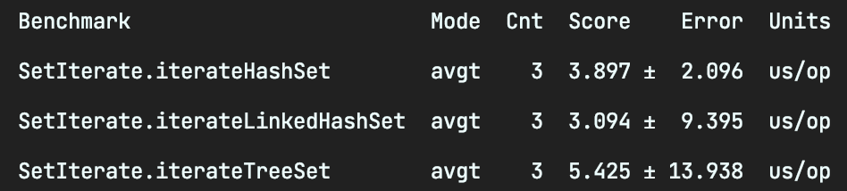

# 4. 어디에 담아야 하는지...

## 자바에서 데이터를 저장
- Collection: List, Map, Set .. 상위 인터페이스
- Set: 중복이 없는 컬렉션
- SortedSet: 오름차순 Set 컬렉션
- List: 순서가 있는 컬렉션 (중복 허용, 인덱수 존재)
- Map: key, value가 한쌍으로 존재 (key 중복 X)
- SortedMap: 키를 오름차순으로 정렬한 Map 인터페이스

## Set 인터페이스
- HashSet: 순서 없이 데이터를 해쉬 테이블에 저장
- TreeSet: red-black 트리에 데이터를 저장 (데이터를 저장하면서 자동을 정렬을 한다)
- LinkedHashSet: 저장된 순서에 따라서 해쉬 테이블에 저장
### [속도 비교] Set 데이터 추가

속도: HashSet > LinkedHashSet > TreeSet
### [속도 비교] Set 데이터 읽기

속도: LinkedHashSet > HashSet > TreeSet
### [속도 비교] Set 데이터 존재여부 확인

속도: Linked

## List
- Vector: 배열의 크기를 지정할 필요가 없는 배열 클래스
- ArrayList: Vector와 비슷하지만 동기화 처리 X
- LinkedList: ArrayList와 동일하지만 Queue 인터페이스를 구현하여 FIFO(선입선출) 성격을 가지고 있음
### [속도 비교] List 데이터 추가

### [속도 비교] List 데이터 읽기

속도: ArrayList > Vector > LinkedList  
Queue의 peek, poll 메소드를 사용하면 ArrayList보다 더 빠르게 처리 가능
### [속도 비교] List 삭제
  
ArrayList, Vector를 이용하여 첫번째 인덱스 값을 계속 삭제하는 방식은 마지막을 삭제하는 방식보다 느리다.  
이유는 ArrayList, Vector는 내부에서 배열을 사용하는데 첫번째 인덱스의 값이 삭제되면 모든 인덱스의 위치를 변경이 필요하기 때문이다.  

## Map
- Hashtable: 데이터를 해쉬 테이블에 저장 (동기화 가능, null 값 불가)
- HashMap: 데이터를 해쉬 테이블에 저장 (동기화 불가, null 값 허용)
- TreeMap: red-black 트리에 데이터를 저장
- LinkedHashMap: HashMap과 거이 동일하며 이중 연결 리스트 방식을 사용하여 데이터 저장

### [속도 비교] Map 데이터 읽기

> 이중 연결 리스트: 앞뒤 노드에 대한 링크 정보를 갖고 있다. 