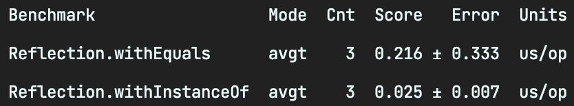

# 7. 클래스 정보, 어떻게 알아낼 수 있나?

## reflection
java의 reflection에 있는 클래스들을 사용하면 JVM에 로딩되어있는 클래스오 메소드 정볼르 읽을 수 있다.

## [성능 비교] getClass() vs instanceOf
  
getClass() 호출 시 class를 생성을 하기 때문에 타입 비교시 instanceOf를 사용하자

## TIP
클래스의 메타 데이터 정보는 JVM의 Perm 영역에 저장된다. 많은 Class를 동적으로 생성하면 Perm 영역에서 OOM이 발생 할 수 있다.