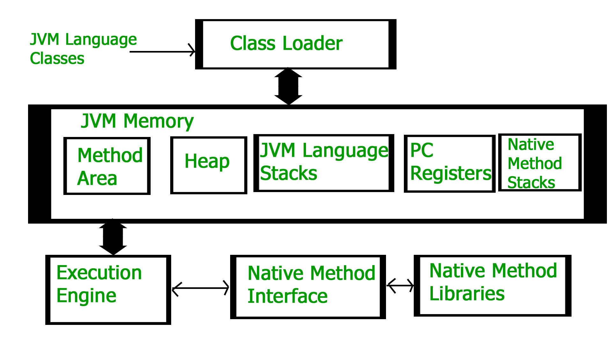
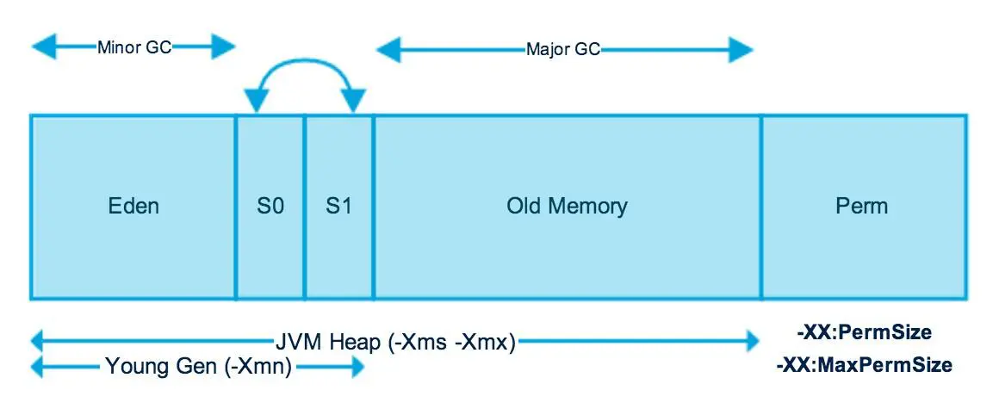

# 도대체 GC는 언제 발생할까?

## GC
- 메모리를 GC라는 알고리즘을 통해서 관리함 (개발자가 메모리 처리하기 위한 로직 필요 없음)
- 필요하지 않는 객체를 메모리에서 해체

## Runtime data area
### 아키텍쳐

### 영역
- PC 레지스터
- JVM 스택
- 힙
- 메서드 영역
- 런타임 상수 풀
- 네이티브 메서드 풀
### Heap 메모리
- 클래스 인스턴스, 배열이 Heap 메모리에 쌓임
- 공유 메모리라고 불리며 여러 스레드에서 공유하는 데이터들이 저장되는 메모리
### Non-heep 메모리
자바의 내부 처리를 위해서 필요
- 메서드 영역
    - 메서드 영역은 모든 JVM 스레드에 공유
    - 런타임 상수 풀, 메서드 데이터, 메서드, 생성자 저장
- JVM 스택
    - 스레드가 시작할 때 JVM 스택 생성
    - 메서드가 호출되는 정보인 프레임이 저장
    - 지역변수, 임시 결과, 메서드 수행/결과에 관한 정보가 포함
- 네이티브 메서드 스택
    - 자바 코드가 아닌 다른 언어로 된 코드들을 실행할때 스택 정보를 관리
- PC 레지스터
    - 자바의 각 스레드는 pc(Program Counter) 레지스터를 갖음
    - 네이티브를 제외한 모든 자바 코드들이 수행될 때 인스턴스 주소를 pc 레지스터에 보관

## 자바 메모리 구조

### Young 영역
- 1개의 Eden, 2개의 Survivor 영역으로 구성되어있음
- 객체 생성시 Eden 영역에 객체 지정
- 만약 Eden의 크기를 초과한 인스턴스인 경우 옮겨지거나 삭제처리
    - 옮겨지는 경우 2개의 Survivor 중 한곳으로 이동, 남은 하나의 Survivor 영역은 GC이후 Eden의 남아있는 객체들이 이동
    - 할당된 Survivor 영역이 차면 GC발생 -> 남은 Survivor 영으로 이동 -> (반복) -> 객체들은 Old 영역으로 이동
    - 객체의 크기가 아주 큰 경우(Survivor 크기보다 큰 경우) Old 영역으로 이동

## GC 종류
- 마이너 GC: Young 영역에서 발생하는 GC
- 메이저 GC: Old, Perm 영역에서 발생하는 GC

## 자료 이미지 주소
- https://www.geeksforgeeks.org/jvm-works-jvm-architecture/
- https://www.betsol.com/blog/java-memory-management-for-java-virtual-machine-jvm/