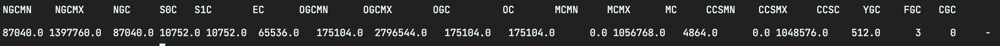
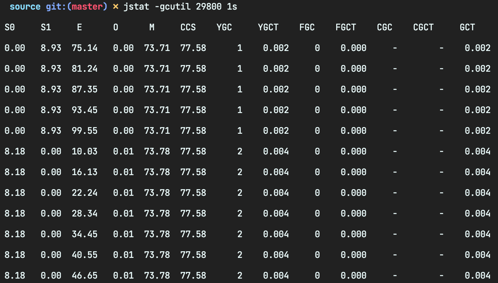

# GC가 어떻게 수행되고 있는지 보고 싶다

## 자바 인스턴스 확인을 위한 jps
- 명령어: jps [-q] [-mlvV] [-Joption] [<hostid>]
    - q: 클래스나 JAR 파일명, 인수 등을 생략하고 pid만 나타냄
    - m: main 메서드에 지정한 인수들을 나타냄
    - l: main 클래스, jar 파일의 전체 경로 이름을 나타냄
    - v: JVM에 전달된 자바 옵션 목록
    - V: JVM의 플래그 파일을 통해 전달된 인수를 나타냄
    - Joption: 자바 옵션을 

## GC 상황을 확인하는 jstat
``` bash 
$> jstat -<option> [-t] [-h<lines>] <vmid> [<interval> [<count>]]
```
- GC가 수행되는 정보를 확인하기 위한 명령어이다
- 명령어
    - option
        - class: 클래스 로더에 대한 통계
        - compiler: 핫스팟 JIT 컴파일러에 대한 통계
        - gc: GC 힙 영역에 대한 통계
        - gccapacity: 각 영역의 허용치와 연관된 영역에 대한 통계
        - gccause: GC의 요약 정보, 마지막 GC와 현재 GC에 대한 통계
        - gcnew: 각 영역에 대한 통계
        - gcnewcapacity: Young 영역과 관련된 영역에 대한 통계
        - gcold: Old, Perm 영역의 통계
        - gcoldcapacity: Old 영역의 크기에 대한 통계
        - gcpermcapactity: Perm 영역의 크기에 대한 통계
        - gcutil: GC에 대한 요약 정보
        - printcompilaction: 핫 스팟 컴파일 메서드에 대한 통계
    - t: 수행 시간 표시
    - h:lines: 각 열의 설명을 지정된 라인 주기 표시
    - interval: 로그를 남기는 시간의 차이
    - count: 로그를 남기는 횟수
- jstat 로그를 남겨 분석하는데는 한계가 존재 (정확한 분석을 위해서는 verbosegc 옵션 사용 권장)
### 명령어 활용

- 명령어 jstat -gccapacity [pid]
- 정리
    - NGC: New(Young) 영역의 크기
    - OGC: Old 영역의 크기
    - S0C, S1C: Survivor 할당된 크기
    - EC: Eden 할당된 크기
    - OC: Old 할당된 크기
    - MN, MX, C: Min, Max, Committed를 의미
    - FCG, YGC: Full GC, Minor GC


- 명령어: jstat -gcutil [pid] 1s
- 힙 영역의 사용량 %로 표현
- 정리
    - YGC: Young 영역의 GC 횟수
    - YGCT: Young 영역의 GC가 수행된 누적 시간(초)
    - FGC: Old 영역의 GC 횟수
    - FGCT: Old 영역의 GC가 수행된 누적 시간(초)

## verboasegc 옵션ㅇ르 이용하여 gc 로그 남기기
- 기본 명령어: java -verbosegc <기타 다른 옵션> 자바애플리케이션 이름
- 옵션 추가 
    - PrintGCTimeStamps: 시간을 로그에 포함
    - PrintHeepAtGC: GC에 대한 많은 정보를 볼수 있음
    - PrintGCDetails: PrintHeepAtGC보다 좀더 간결함
