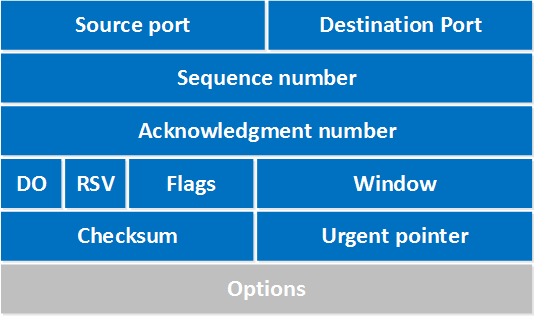

# 웹과 네트워크의 기본에 대해 알아보자

## TCP/IP
- 애플리케이션 계층
    - 사용자에게 제공되는 애플리케이션에서 사용
        - FTP, DNS, SSH, HTTP 등
- 트랜스포트 계층
    - 통신 노드 사이의 데이터 흐름을 제공
    - TCP/UDP 프로토콜을 사용
- 네트워크 계층(인터넷 계층)
    - 네트워크 상에서 패킷의 이동을 다룸
- 링크 계층
    - 하드웨어적 측면을 다룸

## 통신흐름
1. HTTP 요청
2. 트랜스포트 계층에서 segment 단위로 나누어 네트워크 계층에 전달 ([TCP 헤더 추가](#TCP-헤더-구조))
3. 네트워크 계층에서는 수신지 MAC주소를 추가하여 링크 계층으로 전달
4. 수신측 서버는 링크 계층에서 데이터를 받아 상위 계층으로 전달한다.
5. 수신측에서는 HTTP 요청 내용을 수신한다.

> 하위 계층으로 가면 각 계층별 헤더를 추가하고, 상위 계층으로 가면 각 계층별 헤더를 삭제한다.  
이렇게 정보를 감싸는 것을 캡슐화라고 부른다.

## IP (Internet Protocol)
IP의 역할은 패킷을 상대방에게 전달하는 것이다.

## TCP 헤더 구조
  

최소 20 ~ 60byte 크기이다.
- Source port (16bit)
    - 송신자 포트
- Destination port (16bit)
    - 수신자 포트
- Sequence number (32bit)
    - segment 데이터 순서를 표시 (고유번호, 중복 X)
    - 3Way-Handshacking 시 ISN을 사용하여 초기 Sequence number를 설정
    - **Acknowledment number**와 함께 통신의 신뢰성을 보장
- Acknowledment number (32bit)
    - 다음 수신할 segment의 sequence number이다. (현재 수신된 sequence number + 1)
- DO (4bit)
    - 헤더 전체 길이
    - 32bit 단위로 나타냄
- RSV (3bit)
    - 예약 필드
- Flags (9bit)
    - URG: 긴급처리, 다른 데이터보다 우선 순위로 취급
    - ACK: 응답 확인
    - PSH: 버퍼링 데이터를 어플리케이션 계층에 즉시 전달
    - RST: 강제로 연결을 초기화
    - SYN: 3Way-Handshacking에 사용 (통신 연결 요청 시), ISN 사용
    - FIN: 통신 종료
- Window (16bit)
    - 수신버퍼 여유 용량 표시 (byte 단위)
- Checksum (16bit)
    - 세그먼트가 유효한지 체크
- Urgent pointer (16bit)
    - 긴급으로 처리할 데이터의 마지막 바이트 위치를 나타낸다.
- Options (0 ~ 40byte)
    - TCP 연결 관리기능 옵션필드

> ISN (Initial sequence number): 초기 sequence number이다. 0부터 시작하지 않고 난수를 생성한다.  
난수를 생성하는 이유는 IP 스푸핑 방지, 유실 세그먼트 처리 때문이다.  
유실 세그먼트 처리라는것은 유실된 세그먼트와 신규 세그먼트에 sequence number가 동일하면 이전에 유실된 segment가 지금 수신됬다고 서버가 판단할 수 있으므로 ISN를 사용한다.

### 자료주소
TCP 헤더: https://networklessons.com/cisco/ccie-routing-switching-written/tcp-header